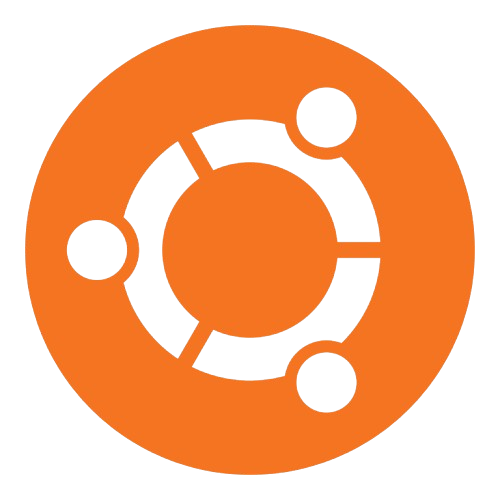

<h1 align="center">
    <strong>PipeTalk</strong>
</h1>

<h2 align="center">
    <i>
        <strong>Dependencies and Prerequisites:</strong>
    </i>
</h2>

<ul>
    <li>
        Operating System: <strong>Linux (Tested on Ubuntu 22.04.5 LTS x86_64)</strong>
    </li>
    

        <strong>
            IMPORTANT: Other Linux distros may as well work
        </strong>
    

    <li>
        Makefile: <strong>GNU Make 4.3</strong>
    </li>
    <li>
    Compiler: <strong>gcc 11.4.0</strong>
    </li>
</ul>

<h2 align="center">
   <i>
     <strong>What is it?</strong>
    </i>
</h2>

    <i>
        <strong>PipeTalk</strong> is a computer program made in C language that represents in practice what is taught in Operating System classes: <strong>IPC</strong> (Inter-Process Communication).
    </i>

    <i>
        <strong>IPC</strong> can work in a lot of different ways, for example with <strong>Memory Sharing</strong>, <strong>Sockets</strong> and with <strong>Pipes</strong>.
        <strong>PipeTalk</strong> is a practical example on how the communication between different processes works through named <strong>pipes</strong>, which is a unidirectional way of communication involving different processes that act as a producer process and a consumer process.
    </i>

    <i>
        <strong>Named pipes</strong> communication works by having a <strong>FIFO file</strong> which is a special system file that is meant to be a communication chanel between processes. So, the <strong>Writer</strong> process writes down a message on the <stron>FIFO file</strong> and the <strong>Reader</strong> process opens the file and reads its content.
    </i>

    <i>
        By performing this procedure, we can implement in practice an <strong>IPC</strong> used in various famous computer applications, for example:
    </i>

<ul>
    <li>Linux Shell</li>
    <li>Logging Systems</li>
    <li>Integration between different Programming Languages</li>
    <li>Microsoft SQL Server</li>
</ul>

    <i>
        <strong>PipeTalk</strong> is a great example, not just on how to implement <strong>IPC</strong>, but it also gathers key comcepts such as <strong>Memory Allocation and Pointers</strong>, <strong>Background Running Processes</strong> and <strong>System Calls in C</strong>. 
    </i>

<h2 align="center">
   <i>
     <strong>How to use it?</strong>
    </i>
</h2>

    <i>
        <strong>PipeTalk</strong> comes with a <strong>Makefile</strong> that compilates the C source code into its binary and makes the <strong>FIFO file</strong>. Run the following prompts on the working directory to clone, compile and run the code (make sure to have <strong>git</strong> instaled on your system):
    </i>

<pre>
    <code class="language-bash">git clone git@github.com:igorruiz123-py/PipeTalk.git</code>
</pre>

or

<pre>
    <code class="language-bash">git clone https://github.com/igorruiz123-py/PipeTalk.git</code>
</pre>

<i>Clone the remote repository</i>

<pre>
    <code class="language-bash">make pipe</code>
</pre>

<i>Make a FIFO file</i>

<pre>
    <code class="language-bash">make writer</code>
</pre>

<i>Compile the writer.c C source code into writer executable code</i>

<pre>
    <code class="language-bash">make reader</code>
</pre>

<i>Compile the reader.c C source code into reader executable code</i>

<pre>
    <code class="language-bash">./reader &</code>
</pre>

<i>Run reader on background</i>

<pre>
    <code class="language-bash">./writer send message [your_message]</code>
</pre>

<i>Send message to FIFO file</i>

<h2 align="center">
    <i>
        <strong>Technologies</strong>
    </i>
</h2>

</img> </img> </img> </img>

    <i>
        Made with 💙 by Igor Ruiz, Cyber Security Student from Federal University of Itajuba.
    </i>

